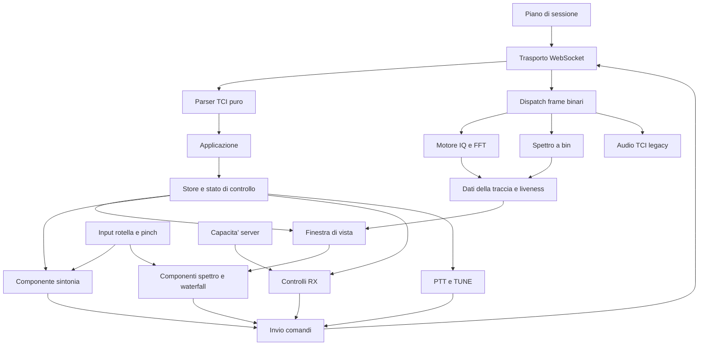
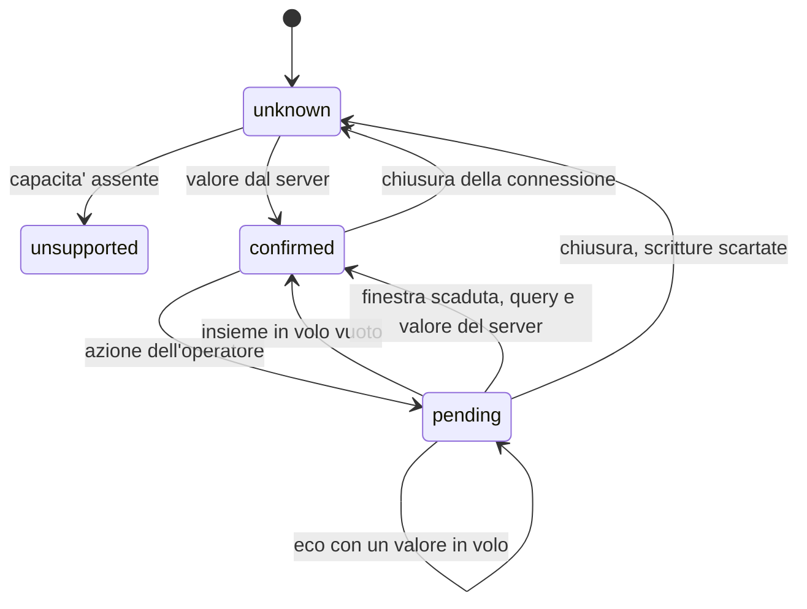
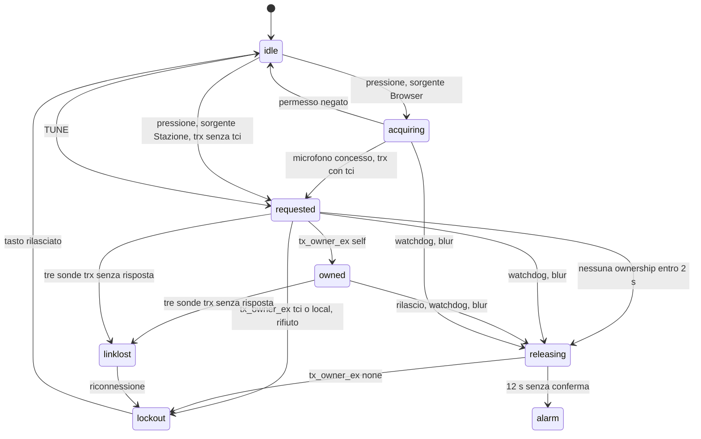
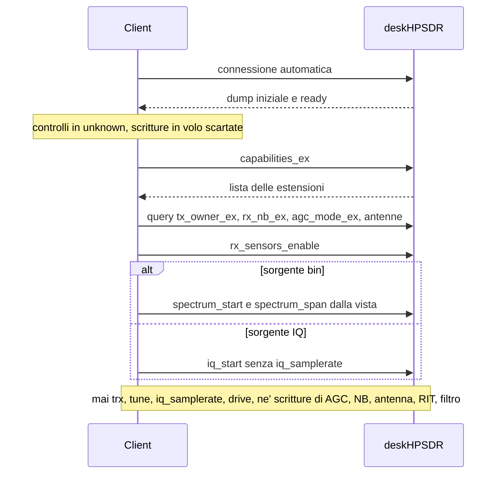
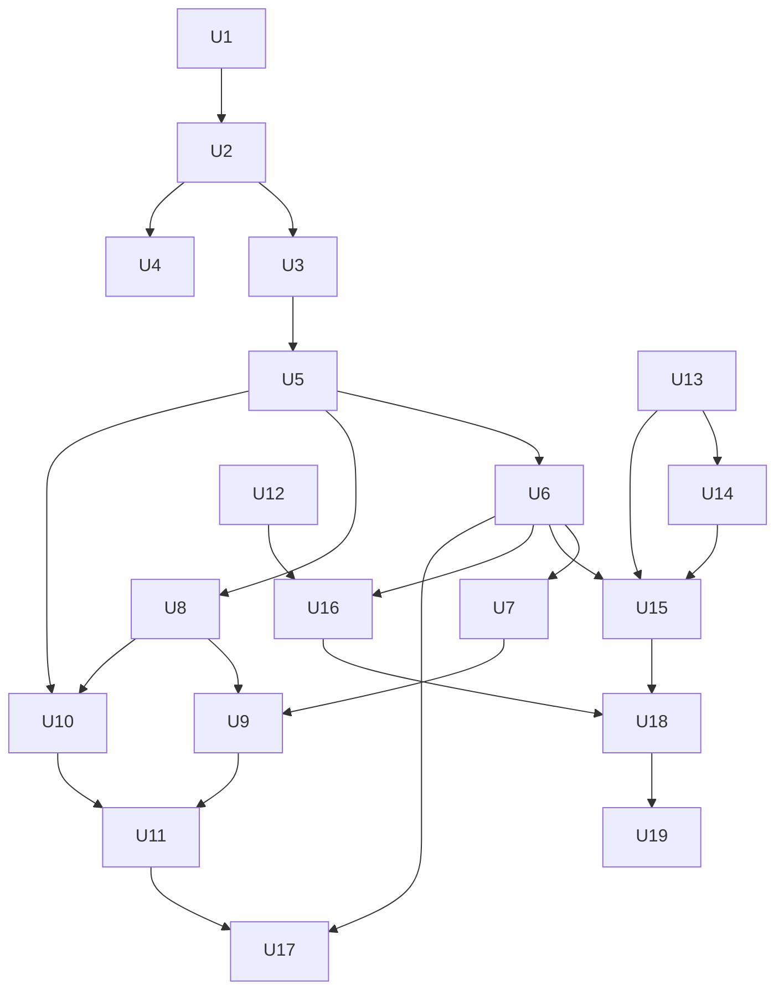

# TOTW sorgente modulare e client operativo - Plan

## Goal Capsule

- **Objective:** l'operatore conduce la stazione remota da TOTW su un portatile, via WireGuard anche su 4G, senza ricorrere alla GUI di deskHPSDR per sintonia, spettro, controlli RX e trasmissione, e senza che un link caduto lasci la radio in TX.
- **Means:** sorgente modulare con `totw.html` generato dalla build (KTD1, KTD2, KTD3), migrazione incrementale guidata dal triage (KTD4-KTD10), comandi TCI nuovi e keepalive nel fork di deskHPSDR (KTD11, KTD13).
- **Authority hierarchy:** `STRATEGY.md` decide cosa e' in strategia. Il Product Contract di questo piano decide il comportamento. I KTD decidono il meccanismo. `documentation/deskHPSDR_TCI_Remote_Extensions.md` di `iu3qez/deskhpsdr` decide il formato del frame `type=4` e delle estensioni. Il sorgente di deskHPSDR e' autoritativo sulla semantica dei comandi. L'implementatore decide nomi e dettagli locali entro le unita'.
- **Stop conditions:** fermarsi e chiedere se:
  1. il `totw.html` generato non si apre da file:// o perde una funzione che la checklist di riferimento di U2 registrava;
  2. un'unita' richiede di cambiare il formato del frame `type=4`;
  3. mantenere audio TCI o codice mobile richiede lavoro oltre il costo zero di R6;
  4. un comando nuovo lato server collide con la semantica di un comando TCI stock;
  5. il keepalive del server chiude client TCI sani.
- **Execution profile:** due repository. Le unita' client stanno in `iu3qez/thetis-on-the-web`. Le unita' server U12, U13 e U14 stanno in `iu3qez/deskhpsdr`, checkout locale dell'operatore. La traccia server procede in parallelo alla traccia client dall'inizio.
- **Tail ownership:** verifica al banco con la radio, WAN simulata e prove con Mumble spettano all'operatore (Simo). Test automatici, build e controlli in browser spettano all'implementatore.

---

## Product Contract

### Summary

Il piano porta il sorgente di TOTW in moduli, con un `totw.html` generato e autocontenuto, e toglie il codice fuori perimetro prima di migrarlo. Corregge il triage del 2026-09-15 estraendo ogni parte toccata come componente. Assorbe spettro a bin, span e selettore di sorgente (ex C3-C5), aggiunge i controlli RX e la sicurezza TX che mancano, anche lato server, e rimanda il MIDI (ex C6-C7) a dopo il rifacimento dei controlli.

### Problem Frame

Al banco del 2026-09-15 C1 e C2 passano, ma l'operatore giudica TOTW inusabile come interfaccia radio. Il triage raccoglie guasti e mancanze: la rotella sul VFO produce `NaN` e blocca la sintonia, il trackpad sintonizza e zooma di un passo intero per evento, il waterfall ignora lo zoom, non esiste uno slider di zoom, lo smoothing rende lo spettro quasi fermo a 48 kHz, il RIT e' finto, NB, AGC, antenna e zero-beat mancano, l'S-meter ignora la risposta del server, il PTT trasmette sempre il microfono del browser.

I difetti hanno cause strutturali. Il client e' un file di 8914 righe in un solo scope globale. `S.vfoA` ha 10 punti di scrittura, la conversione Hz↔px e' ricopiata in 13 punti, il parser TCI scrive nel DOM, 138 attributi inline chiamano 45 funzioni globali. Il `NaN` nasce da tre pulsanti della barra con `class="band-btn"` catturati dal listener delle bande (`totw.html:3313`, `totw.html:4595`). Correzioni locali su questa base si rompono a vicenda.

Una parte del lavoro sta nel server. deskHPSDR scarta in silenzio `rx_antenna`, non ha comandi TCI per NB/NB2, antenna e zero-beat, e riduce l'AGC a tre stati. Rilascia il TX di un client TCI solo alla chiusura del socket e non ha keepalive (`src/tci.c:7099`, ping commentato a `src/tci.c:6564`). Un link 4G caduto senza chiusura lascia la radio in trasmissione fino al timeout TCP del server, circa 15 minuti se il server ha dati da mandare, altrimenti senza limite. L'eco `trx` non distingue il proprio TX da quello di altri, e sotto congestione il server scarta messaggi di testo che non rimanda piu'. Il keepalive di CWNet copre solo il TX avviato dalla catena CW.

Il piano del 2026-09-09 vincolava ogni unita' al singolo file, vietava modifiche al codice di disegno ed escludeva modifiche al server. Tutti e tre i vincoli impediscono queste correzioni.

### Requirements

**Artefatto e sorgente**

- R1. `totw.html` e' generato da `src/` con una build e resta un documento autocontenuto che si apre da file:// in Chrome e Firefox desktop.
- R2. La build e' l'unica via per cambiare `totw.html`; la variante `website/` e la direzione `bundle` spariscono.
- R3. Impostazioni, stato salvato e backup degli utenti esistenti sopravvivono all'aggiornamento; le chiavi delle funzioni rimosse si scartano senza errori.

**Rimozioni e perimetro**

- R4. Escono dal client: DX cluster, greyline, dati hamqsl, marker WSPR/JS8, controllo aggiornamenti e badge, riferimenti al progetto originale, resti Thetis, palette waterfall alternative, memorie, ripiego FFT audio nello spettro, codice morto.
- R5. Restano i temi UI multipli.
- R6. Audio TCI nel browser e codice mobile/touch restano a costo zero: si spostano come sono, si collegano ai nuovi setter solo dove non costa lavoro, altrimenti possono degradare.

**Sintonia**

- R7. Nessuna azione dell'operatore porta il VFO a un valore non numerico o fuori range.
- R8. Rotella, trackpad e pinch hanno sensibilita' coerente: uno scatto di rotella vale un passo, il trackpad accumula fino a una soglia, il pinch zooma in modo continuo.
- R9. Un comando di sintonia rifiutato o sovrascritto dal server non lascia il display divergente dalla radio.

**Spettro e waterfall**

- R10. Spettro, waterfall, marker, click, hover e S-meter da IQ usano la stessa finestra di vista in frequenza.
- R11. Uno slider regola lo zoom del panadapter.
- R12. Il waterfall resta allineato in frequenza dopo QSY e cambi di zoom.
- R13. La media dello spettro ha la stessa costante di tempo a qualunque sample rate.
- R14. Senza frame nuovi il pannello dichiara la traccia non viva invece di mostrare l'ultimo frame.
- R15. Lo spettro a bin `type=4` alimenta la stessa traccia dell'IQ (origin CLI-03).
- R16. In modalita' bin lo zoom chiede al server lo span visibile e la vista mostra lo span servito (origin CLI-04).
- R17. La sorgente spettro, bin o IQ, e' una scelta esplicita e persistente, con la pausa in TX visibile (origin CLI-05).

**Controlli RX**

- R18. Il RIT funziona: abilitazione, offset, azzeramento.
- R19. L'AGC offre tutti i modi della radio e il livello.
- R20. SNB on/off e NB off/NB/NB2 sono controlli distinti.
- R21. Si scelgono antenna RX (ANT1-3, EXT1, EXT2, XVTR) e antenna TX (ANT1-3) della banda corrente.
- R22. Lo zero-beat CW automatico si avvia dal client e riporta l'esito all'operatore.
- R23. L'S-meter legge `rx_sensors` e in TX mostra lo stato TX invece dell'ultimo valore.
- R24. Lo split si mostra correttamente e il volume RX2 si invia nel formato accettato dal server.
- R25. Un controllo che il server non supporta o rifiuta lo dice all'operatore invece di restare muto.

**Trasmissione e sicurezza**

- R26. La sorgente dell'audio TX del PTT e' una scelta esplicita e persistente: Stazione o Browser (TCI).
- R27. Se il link fra client e server cade senza chiusura, il server rilascia il TX entro pochi secondi.
- R28. PTT e TUNE hanno un watchdog lato client con il timeout delle impostazioni; il PTT da tastiera si rilascia quando la finestra perde il focus.
- R29. Un PTT rifiutato o conteso non lascia il client in TX apparente ne' con il microfono in upload, e il client distingue il proprio TX da quello avviato da altri.

**Connessione**

- R30. L'indirizzo della stazione si ricorda dall'ultimo tentativo, riuscito o no.
- R31. Una riconnessione ripristina le sottoscrizioni del client e non riscrive i parametri della radio.
- R32. Il log TCI resta leggibile al banco: i messaggi periodici noti non lo inondano.

**MIDI**

- R33. Web MIDI con learn mode, encoder, coalescenza e persistenza (origin CLI-06), dopo il rifacimento dei controlli.
- R34. La tabella azioni MIDI usa le funzioni dei controlli su schermo, inclusi i controlli nuovi (origin CLI-07).
- R35. La mappatura MIDI sopravvive al salvataggio delle impostazioni.

**Documentazione**

- R36. Un inventario dei controlli della UI resta allineato al codice.
- R37. I comandi TCI nuovi sono documentati nel contratto delle estensioni del fork.
- R38. `CONCEPTS.md`, `README.md` e il piano del 2026-09-09 riflettono il nuovo flusso sorgente→artefatto.

### Key Decisions

- **Sorgente modulare, file portabile generato.** Il file unico resta come artefatto, non come sorgente. (session-settled: user-directed — chosen over tenere `totw.html` come sorgente: le correzioni resterebbero patch dentro 8914 righe in scope globale.) Governs R1, R2, R38.
- **Piano nuovo; quello del 2026-09-09 resta registro di C1 e C2.** (session-settled: user-approved — chosen over aggiornarlo in place: scope, stop condition e Definition of Done del vecchio piano sono rovesciati.) Governs R38.
- **Criterio del triage: l'operativita'.** Tutto cio' che impedisce di usare la radio e' un problema, in qualunque repository stia la correzione. (session-settled: user-directed — chosen over limitare il perimetro a cio' che citano i requisiti della stazione.) Governs R18, R19, R20, R21, R22, R23, R24, R25, R27.
- **Lavoro server in questo piano.** (session-settled: user-approved — chosen over un piano separato in `iu3qez/deskhpsdr`: le unita' client dipendono direttamente dai comandi nuovi.) Governs R19, R20, R21, R22, R27, R37.
- **Rimozione prima della migrazione.** (session-settled: user-approved — chosen over modularizzare tutto e togliere dopo: meno codice da migrare.) Governs R4.
- **Cosa esce e cosa resta.** Escono le funzioni elencate in R4, restano i temi UI. (session-settled: user-directed — chosen over tenere le funzioni ereditate: selezione dell'operatore del 2026-09-15.) Governs R4, R5.
- **Audio TCI e mobile a costo zero.** (session-settled: user-directed — chosen over rimuoverli o supportarli: servono ancora, ma senza investimento.) Governs R6.
- **Spettro a bin dentro il lavoro sullo spettro, MIDI dopo i controlli.** (session-settled: user-directed — chosen over rimandare tutte le unita' C3-C7 dopo il triage: zoom e ciclo degli stream si toccano una volta sola.) Governs R15, R16, R17, R33, R34.
- **Zero-beat automatico, non tono di spot.** (session-settled: user-approved — chosen over un tono di spot manuale: la funzione esiste gia' nel server.) Governs R22.
- **Due sorgenti audio TX selezionabili.** (session-settled: user-directed — chosen over una sola sorgente fissa: servono entrambe durante le prove di Mumble.) Governs R26.
- **Keepalive TCI sul modello CWNet.** (session-settled: user-directed — chosen over documentare solo il rischio: il TX avviato da TOTW non e' coperto dal keepalive di CWNet.) Governs R27, R28.
- **Ridisegno della UI fuori da questo piano.** Qui solo l'inventario. (session-settled: user-approved — chosen over includere il ridisegno con Claude Design: richiede componenti gia' estratti.) Governs R36.

### Acceptance Examples

- AE1. Covers R7.
  - **Given:** la modale delle impostazioni e' appena stata aperta.
  - **When:** l'operatore usa la rotella sulle cifre del VFO.
  - **Then:** la frequenza cambia di un passo e la console non ha errori.
- AE2. Covers R8.
  - **Given:** il trackpad di un MacBook.
  - **When:** l'operatore fa uno swipe a due dita sul VFO, poi un pinch sullo spettro.
  - **Then:** il VFO si sposta di un numero di passi proporzionale allo swipe, non di un passo per evento; lo zoom cambia in modo continuo e non salta da 1× a 32× in un gesto.
- AE3. Covers R10, R12.
  - **Given:** zoom 8× centrato sul VFO, una portante visibile.
  - **When:** l'operatore sintonizza di 2 kHz.
  - **Then:** la portante resta alla stessa x su spettro e waterfall, e le righe sopra la mostrano alla sua frequenza vera.
- AE4. Covers R14.
  - **Given:** sorgente IQ e traccia viva.
  - **When:** il server ferma lo stream IQ.
  - **Then:** entro 2 s il pannello mostra la traccia come non viva.
- AE5. Covers R16.
  - **Given:** sorgente bin con 512 bin.
  - **When:** lo zoom passa da 1 a 8.
  - **Then:** il client invia un solo `spectrum_span` e l'Hz/bin servito mostrato scende. Il guadagno e' limitato dalla larghezza del panadapter locale di deskHPSDR, quindi il ×8 del piano 2026-09-09 non e' garantito.
- AE6. Covers R25.
  - **Given:** una build di deskHPSDR senza le estensioni di U13 e U14.
  - **When:** il client si connette.
  - **Then:** i controlli antenna, NB e zero-beat sono disabilitati con un messaggio che nomina la capacita' mancante.
- AE7. Covers R26, R29.
  - **Given:** sorgente Stazione.
  - **When:** l'operatore preme PTT.
  - **Then:** il client invia `trx:0,true` senza `tci` e non chiede il microfono. Con sorgente Browser e permesso del microfono negato, la radio non va in TX.
- AE8. Covers R27.
  - **Given:** TX avviato da TOTW su carico fittizio, con uno stream spettro attivo.
  - **When:** il link si interrompe senza chiusura, simulato con una regola DROP sulla stazione verso l'IP del portatile.
  - **Then:** la radio torna in RX entro la soglia dell'owner (KTD13) piu' un intervallo di ping, misurati dall'ultimo pong.
- AE9. Covers R31.
  - **Given:** sorgente bin.
  - **When:** il link cade e si riconnette.
  - **Then:** il client rimanda solo la sottoscrizione dello spettro e le query di stato, senza `iq_samplerate`, `iq_start`, `audio_start`, `trx`, `tune` o `drive`.

### Scope Boundaries

- Ridisegno della UI con Claude Design e sincronizzazione DesignSync.
- Correzione del ritardo crescente dello scheduler audio (R6).
- Supporto mobile oltre il costo zero; `STRATEGY.md` resta invariato.
- Compatibilita' con Thetis o con altri server TCI.
- Tono di spot CW manuale.
- Multi-operatore.
- Porta TCI della stazione (50001 contro 40001): configurazione dell'operatore.

#### Deferred to Follow-Up Work

- Selezione del tipo di NR (NR1-4): il server ignora `rx_nr_enable_ex` e sceglie l'NR di default per il modo.
- Accensione di RX2 da TCI: `rx_enable` e' solo query nel server.
- Difetto server `audio_stream_channels:1` nel testo contro `channels = 2` nell'header binario (CTD8 del piano 2026-09-09).
- Delta frame sullo spettro (dal piano 2026-09-09).
- Estrazione di audio TCI e mobile in componenti.
- Tempo massimo di TX lato server per gli owner TCI (per esempio MOX 600 s, TUNE 120 s). Non scelto dall'operatore: il keepalive di KTD13 copre il link caduto, non l'operatore assente con link vivo.
- Sostituzione della connessione per id alla riconnessione: con la soglia dell'owner a 5 s la connessione fantasma si chiude comunque in pochi secondi.
- Arresto remoto di un TX avviato da rigctl o dalla GUI locale: R27 copre solo i client TCI.

### Sources

- Handoff `docs/handoffs/2026-09-15-bench-c1-c2-main-trunk.md`: stato del banco, problemi noti, trappole.
- Piano `docs/plans/2026-09-09-feat-deskhpsdr-client-plan.md`: CTD1-CTD8 e unita' C3-C7, da cui U10, U11, U18 e U19 riprendono approccio e scenari.
- `docs/solutions/best-practices/falsifiable-acceptance-criteria-in-plans.md`: la liveness si misura su un contatore che avanza, non su un flag.
- `iu3qez/deskhpsdr` a `eaec707`, `src/tci.c`: tabella di dispatch 6367-6447, `rx_nb_enable` 4543-4563 e 3789-3820, `rx_att_ex` 5909-5984, `trx` 4284-4383, `tune` 4421, chiusura 7099, `rx_sensors` 6513, mapping AGC 3308-3333. Poi `src/radio.c:2608`, `src/zoompan.c:120-160`, `src/receiver.c:1336-1500`, `src/noise_menu.c:172-316`, `tests/tci_spectrum_test.c`, `stuff/tci_spectrum_probe.py`.
- `iu3qez/deskhpsdr`, `docs/brainstorms/2026-09-08-remote-station-requirements.md`: CLI-03..07, CW-01 (il tool CW passa dal MIDI virtuale, non da TCI).
- `iu3qez/RemoteCWKeyer-esp32`, `docs/plans/2026-01-12-cwnet-protocol-implementation.md`: ping ogni 2 s, disconnessione dopo 5 s di inattivita', gestione PTT.
- esbuild: https://esbuild.github.io/getting-started/ (versione esatta, semver 0.x), https://esbuild.github.io/api/ (IIFE, escape di `</script>`), whatwg/html#8121 (moduli bloccati su file://).
- MDN `WheelEvent.deltaMode`; https://danburzo.ro/dom-gestures/ (pinch come ctrl-wheel).
- Node 26 `node:test`: https://nodejs.org/api/test.html (`mock.timers`, reporter).

---

## Planning Contract

### Key Technical Decisions

- KTD1. **Build con esbuild e uno script Node.** esbuild entra come devDependency con versione esatta e lockfile, perche' le 0.x rompono sulle minor. Lo script chiama l'API con `write:false` e inserisce JS e CSS in un template HTML. Il bundle e' IIFE, non modulo: `type="module"` e `import()` sono bloccati su file:// in Chromium. La sostituzione nel template usa una funzione, non una stringa, perche' `$&` nel codice corromperebbe l'artefatto. La build fallisce se il bundle contiene `</script` o `<!--`. Lo script resta un `<script>` classico senza attributi, nella stessa posizione rispetto al markup: le query eseguite al caricamento dipendono da quali elementi lo precedono. (session-settled: user-approved — chosen over uno script di concatenazione fatto in casa: moduli, escape e watch gia' risolti.)
- KTD2. **`totw.html` generato e committato, con prova di allineamento.** Il file resta nel repository perche' e' l'artefatto che si scarica e si apre da disco. Porta in testa un commento GENERATED e la nota di licenza MIT, che la licenza richiede in ogni copia. Un test ricostruisce l'artefatto e fallisce se differisce dal file committato.
- KTD3. **Primo spostamento senza cambi di comportamento.** Lo script attuale entra nella build come unica entry senza `import`/`export`, cosi' esbuild non impone lo strict mode. L'IIFE nasconde i nomi globali:
  1. le 45 funzioni chiamate dagli attributi inline si espongono su `window` con una lista esplicita;
  2. i sei attributi che assegnano variabili (`smCal`, `specGain`, `wfSpeed`, `logN`, `IQ.smooth` e `S.analyser`) diventano chiamate a funzione, perche' dentro l'IIFE creerebbero globali nuove in silenzio;
  3. un controllo statico nella build confronta i nomi usati negli attributi con quelli esportati e fallisce se ne manca uno.
- KTD4. **Attributi inline verso delegazione con `data-action`.** Ogni unita' che estrae un componente sostituisce i suoi `onclick`/`oninput` con `data-action` e un listener delegato, e toglie i nomi corrispondenti dalla lista su `window`. Il controllo di KTD3 copre anche i `data-action`. Gli eventi che non risalgono (`focus`, `blur`) restano listener diretti. Audio e mobile possono tenere la lista (R6).
- KTD5. **Componenti in light DOM con forma `mount(el, store)`.** Funzioni factory, non custom element: il foglio di stile globale e i canvas funzionano senza Shadow DOM. Il ciclo `requestAnimationFrame` parte al mount e si ferma al destroy. La stessa forma servira' una pagina di anteprima per componente.
- KTD6. **Parser TCI separato dall'applicazione.** Il parser e' una funzione pura: testo in ingresso, eventi `{comando, argomenti}` in uscita. Uno strato di applicazione aggiorna lo stato; i componenti si abbonano. Oggi `parseTCI` scrive nel DOM e chiama funzioni di UI (`totw.html:4271-4395`). Il dispatch dei frame binari diventa un modulo gemello con tabella tipo→handler, secondo CTD1 del piano 2026-09-09.
- KTD7. **Store con setter validati e stato di controllo.** Lo stato della radio vive in un modulo con setter che rifiutano valori non finiti o fuori range e notificano gli abbonati. Ogni controllo che manda un comando ha uno stato:
  - `unknown` alla connessione e dopo ogni chiusura, finche' il server non comunica il valore;
  - `pending` mentre esistono comandi in volo; un'eco con un valore nell'insieme dei comandi in volo non sposta il display;
  - `confirmed` quando l'insieme in volo si svuota, o allo scadere della finestra con il valore del server;
  - `unsupported` quando il server non offre il comando (KTD12).

  La finestra e' scorrevole dall'ultimo invio e vale max(1 s, 3 × RTT misurato), perche' a 20 comandi al secondo e 300 ms di RTT l'eco e' indietro di diversi passi. Allo scadere il client interroga il valore (`vfo:0,0;` esiste gia', `src/tci.c:5121-5132`) invece di attendere un broadcast: il server aggiorna `last_fa` all'invio e il reporter non rimanda un'eco persa. Il set-lock dei comandi stock risponde con il valore corrente, senza `,error`. Lo stato sostituisce `bpIgnoreVfoUpdateUntil`, oggi scritto in 11 punti (R9).
- KTD8. **Una sola finestra di vista in frequenza.** Un modulo possiede centro e span visibili e le conversioni Hz↔px. Spettro, waterfall, marker, click, drag, hover e S-meter da IQ lo usano. In modalita' IQ lo zoom ritaglia la banda IQ in locale. In modalita' bin la vista coincide con lo span servito e lo zoom si applica una volta sola, come richiesta di span: sostituisce CTD2 del piano 2026-09-09, che con lo span dal server avrebbe applicato lo zoom due volte. Il waterfall salva per ogni riga la finestra `[low, high]` con cui e' stata calcolata e la riproietta sulla vista corrente (R12).
- KTD9. **Input da rotella normalizzato in un modulo.** Il modulo converte `deltaMode` riga e pagina in pixel, accumula fino a una soglia per passo e azzera l'accumulo dopo 150 ms di pausa. `ctrlKey` sulla rotella e' pinch: zoom continuo con fattore esponenziale su `deltaY`, mai ×2 per evento. Lo usano display VFO, spettro e slider. Sul display VFO `ctrlKey` smette di valere ×10 (`totw.html:7797`), perche' su macOS il pinch arriva come ctrl-wheel.
- KTD10. **Smoothing come costante di tempo, liveness come timestamp.** Il coefficiente e' α = exp(−Δt/τ), con Δt = N/SR per la FFT locale. Lo slider esprime τ in secondi, default 0,4 s, il valore che la media aveva a 192 kHz. In modalita' bin nessuno smoothing (CTD3 del piano 2026-09-09). Il tempo dell'ultimo frame sostituisce `IQ.fftReady`: oltre 1 s senza frame la traccia non e' viva. La media si azzera a ogni cambio di rate, banda o sorgente. Il vecchio valore percentuale salvato non si converte: la migrazione di KTD16 lo sostituisce con il default, perche' nessuna conversione restituisce la media che l'operatore vedeva a un rate diverso.
- KTD11. **Comandi server nuovi con suffisso `_ex`.** Seguono la convenzione del fork: handler sul thread libwebsockets, applicazione sul main loop GTK con `g_idle_add` dentro `tci_begin_apply`/`tci_end_apply`, set-lock per gruppo di parametri, nessuna voce nel dump iniziale. Due deviazioni: fanno broadcast a tutti i client e hanno hook dai callback della GUI, perche' antenna, NB e AGC cambiano anche da GUI locale, da cambio banda e da altri client. I rifiuti rispondono `,error,<motivo>` come `band_ex`. I comandi sono:

  | Comando | Forma | Regole |
  |---|---|---|
  | `capabilities_ex` | `capabilities_ex;` | versione del fork e lista delle estensioni della build |
  | `tx_owner_ex` | `tx_owner_ex:0;` | risposta `tx_owner_ex:0,<self\|tci\|local\|none>,<mox\|tune\|none>` calcolata per ogni client; inviata al richiedente dopo ogni `trx` e `tune` con valore, e in broadcast a ogni cambio di owner |
  | `rx_nb_ex` | `rx_nb_ex:<rx>[,off\|nb\|nb2]` | applica come `update_noise_for_rx`; `rx_nb_enable` resta l'SNB |
  | `agc_mode_ex` | `agc_mode_ex:<rx>[,off\|long\|slow\|medium\|fast]` | enum completo; `agc_mode` stock invariato |
  | `rx_antenna_ex` | `rx_antenna_ex:<rx>[,0..5]` | banda del VFO A; `rx` diverso da 0 rifiutato; risposta con valore, massimo e banda |
  | `tx_antenna_ex` | `tx_antenna_ex:<trx>[,0..2]` | banda del VFO TX; rifiutato in MOX e TUNE |
  | `cw_zero_beat_ex` | `cw_zero_beat_ex:<rx>;` | risposta differita `moved,<Hz>`, `zero`, `nopeak`, `range`, `refused,<motivo>`; rifiutato fuori CW, in TX, con RIT attivo o in split |

  I comandi antenna si rifiutano dove la GUI nasconde il controllo: protocollo diverso da P2 e da HL2 in P1, `HERMES_MODE_BRICK`.
- KTD12. **Scoperta delle capacita' del server.** Dopo `ready` il client chiede `capabilities_ex` prima di avviare qualunque stream, perche' la coda di invio del server e' condivisa con i frame binari. Senza risposta entro 2 s le capacita' restano `unknown` e la richiesta si ripete; una risposta tardiva abilita i controlli. Un comando assente dalla lista disabilita i controlli che ne dipendono con un messaggio (R25). La cache si invalida a ogni chiusura, perche' il server puo' ripartire con un'altra build. Il server scarta in silenzio i comandi sconosciuti (`src/tci.c:6485-6493`), quindi l'attesa dell'eco non basta.
- KTD13. **Keepalive TCI sul modello CWNet, con rilascio indipendente dalla chiusura.** Il server manda un ping WebSocket ogni 2 s fuori dalla coda dei frame, perche' dietro 100 frame in coda uno stallo 4G lo ritarderebbe. Rileva l'inattivita' sul thread libwebsockets con due soglie:
  - 5 s per il client che possiede il TX, come CWNet;
  - 20 s per gli altri client, cosi' la sessione RX non si riconnette a ogni stallo 4G.

  Superata la soglia il server rilascia prima il TX, poi chiude la connessione a forza (`LWS_TO_KILL_ASYNC`, gia' usato a `src/tci.c:542`) senza handshake di chiusura, che su un socket half-open non completa. Il rilascio passa da una sola funzione idempotente chiamata da `stop`, da `LWS_CALLBACK_CLOSED` e dal rilevatore di inattivita', al posto del codice oggi duplicato. I frame di testo non contano sul limite dei frame binari in coda, e i campi `last_*` si aggiornano solo se l'accodamento riesce, altrimenti un'eco persa sotto congestione non torna piu'. Parametri nei props, 0 disabilita. I browser rispondono ai ping dallo stack di rete, fuori dal throttling dei timer JavaScript. Governs R27, R28 (session-settled: user-directed — chosen over documentare solo il rischio: il TX avviato da TOTW non e' coperto dal keepalive di CWNet). Scostamento da CWNet: la soglia di 20 s per i client senza TX non c'e' in CWNet, dove la connessione esiste solo per trasmettere.
- KTD14. **PTT e TUNE in una macchina a stati guidata dall'ownership.** L'eco `trx` non basta: il server risponde `trx:0,true` anche quando rifiuta, se la radio sta gia' trasmettendo (`src/tci.c:1690-1697`, `src/tci.c:4337-4348`). Le transizioni seguono `tx_owner_ex` (KTD11). Senza quella capacita' il client rifiuta localmente la pressione quando la radio e' gia' in TX.
  - Stati: idle, acquiring, requested, owned, releasing, lockout, link-lost, alarm. PTT e TUNE usano la stessa macchina e si escludono nella UI.
  - Con sorgente Browser il microfono si cattura dalla pressione in un buffer; l'upload parte solo quando il server assegna l'ownership, cosi' la prima sillaba non si perde. Con permesso negato nessun TX.
  - Watchdog con `cfgPttTimeout` (oggi salvato e ignorato, `totw.html:4712`), rilascio su `blur` e `visibilitychange`: valgono in acquiring, requested e owned.
  - `releasing` dura almeno 12 s, piu' dei 5 s di drain audio e 6,5 s di drain MOX del server (`src/tci.c:2275-2276`). Nel frattempo il client interroga `trx:0;` e reinvia il rilascio. Allo scadere mostra un allarme "stato TX ignoto" e non torna in silenzio a idle.
  - In ogni stato diverso da idle il client interroga `trx:0;` una volta al secondo: tre risposte mancate portano a link-lost, con upload fermo, UI in allarme, chiusura forzata e riconnessione.
  - Dopo watchdog, rifiuto, link perso o riconnessione lo stato e' lockout: una nuova richiesta parte solo dopo il rilascio fisico del tasto. L'autorepeat della tastiera (`e.repeat`) si ignora.
  - Il selettore di sorgente e' bloccato in ogni stato diverso da idle, perche' un `trx` ripetuto in TX cambia sorgente lato server (`src/tci.c:4353-4383`).
  - La sorgente di default e' Browser, il comportamento attuale.
- KTD15. **Piano di sessione alla riconnessione.** Lo stato si divide in due.
  - Stato di sessione del client, da ripristinare: sorgente spettro con bin, fps e span, `rx_sensors_enable` con intervallo, `iq_start` in modalita' IQ, audio RX solo se era attivo in modalita' IQ.
  - Stato della radio, da rileggere e mai riscrivere: rate IQ, AGC, NB, antenna, RIT, filtro. Dopo `capabilities_ex` il client interroga le estensioni disponibili, che non stanno nel dump iniziale.
  - Mai inviati in automatico: `trx`, `tune`, `iq_samplerate`, `drive`.

  Alla chiusura gli stati dei controlli tornano `unknown` e le scritture in volo si scartano senza reinvio. `iq_samplerate` parte solo alla connessione chiesta dall'operatore o al cambio del campo. In modalita' bin non partono ne' IQ ne' audio TCI, perche' il server scrive lo slot spettro solo a coda vuota (contratto delle estensioni §2.4). In modalita' IQ l'avvio automatico dell'audio resta com'e' (R6).
- KTD16. **Persistenza: fusione, versioni e migrazioni idempotenti.**
  - `saveSettings` fonde i campi del form nella configurazione esistente invece di riscriverla (`totw.html:7409-7440`). Oggi ogni chiave fuori dal form si perde a ogni salvataggio.
  - `totw_cfg_v1` passa a schema v4, che toglie le chiavi di DX, greyline e marker.
  - `totw_v1` riceve una versione propria e una funzione di migrazione gemella: oggi non ha versione, e `fftSmooth` cambia significato da percentuale a secondi. La migrazione sostituisce il valore percentuale con il default di KTD10.
  - Le due migrazioni sono idempotenti: `applyLayoutPreset` migra due volte a ogni clic (`totw.html:7625-7638`).
  - `loadState`, l'export e l'import dei backup passano tutti dalle migrazioni; oggi l'export unisce impostazioni migrate e stato grezzo.
  - Prima della prima migrazione a v4 il client copia le tre chiavi in una chiave di backup, cosi' un ritorno a un `totw.html` precedente si recupera.
  - `totw_mem_v1` resta nel localStorage senza essere letta, e i backup la esportano e la reimportano identica: nessuna cancellazione di dati dell'operatore.
  - Gli id dei pannelli rimossi escono da `PANELS`; gli altri id `dp*` restano invariati.
- KTD17. **Test automatici sul nucleo, UI al banco.** `node --test` copre i moduli senza DOM: parser, dispatch, FFT e smoothing, finestra di vista, input, store, PTT, sessione, migrazione, MIDI. Le fixture sono frame sintetici per tipo e una sessione reale registrata e ridotta; i float si confrontano con tolleranza. Niente automazione del browser: la UI si verifica a mano e al banco, piu' i controlli statici di KTD1 e KTD3. Lato server la logica pura delle estensioni segue il modello di `src/tci_spectrum.c` con test in `tests/`; il resto si prova con `stuff/tci_spectrum_probe.py` e al banco. (session-settled: user-approved — chosen over un framework end-to-end o uno script Playwright: toolchain minima.)
- KTD18. **Correzioni di una riga prima della migrazione.** Selettore delle bande, lettura dello split, volume RX2 e lettura di `rx_sensors` si correggono subito nel file attuale. Sono pochi caratteri ciascuno e rendono la radio usabile durante la migrazione.

### High-Level Technical Design

**Moduli del client dopo la migrazione.** Il protocollo scorre in un verso solo: trasporto, parser, applicazione, store, componenti. I componenti non chiamano il trasporto direttamente per lo stato: passano dallo stato di controllo.



**Stato di un controllo (KTD7, KTD12).**



**PTT e TUNE (KTD14).**



**Riconnessione (KTD15).**



**Dipendenze fra unita'.** La traccia server parte subito. Nella traccia spettro i guasti bloccanti (U8, U9) precedono lo spettro a bin (U10, U11).



### Output Structure

Forma attesa, non vincolante: i campi **Files** delle unita' restano autoritativi.

```text
package.json
package-lock.json
scripts/
  build.mjs
src/
  template.html
  main.js
  legacy/totw-legacy.js
  styles/totw.css
  core/        tci-parser, tci-apply, frame-dispatch, store, control-state, capabilities, session, ptt, spectrum-session
  dsp/         iq-fft, smoothing, view-window, liveness, bin-spectrum
  input/       wheel
  persist/     settings, state
  ui/          tuning, spectrum, waterfall, zoom-slider, spectrum-source, smeter, rx-controls, tx-controls, connection
  midi/        access, normalize, learn, actions
test/
  *.test.mjs
  fixtures/    frames, sessions, settings
docs/
  ui-inventory.md
  bench/reference-checklist.md
totw.html      artefatto generato
```

### Sequencing

- **Fase A, base:** U1, U2, U3, U4. U1 rende la radio usabile subito; U2 toglie il codice che non si migra; U3 introduce la build.
- **Fase B, nucleo:** U5, U6.
- **Fase C, triage:** U7, U8, U9, poi U10 e U11; U15, U16, U17.
- **Traccia server, in parallelo da subito:** U12 per prima per sicurezza, poi U13 e U14.
- **Fase D, MIDI:** U18, U19.

### Assumptions

- Il valore di default della sorgente audio TX e' Browser, cioe' il comportamento attuale. L'operatore ha scelto le due sorgenti, non il default.
- I browser desktop rispondono ai ping WebSocket anche con la scheda in background.
- Le soglie di rotella, pinch, liveness e `bufferedAmount` si tarano al banco; i valori nei KTD sono punti di partenza.

### Deferred to Implementation

- Soglie numeriche di rotella e pinch (KTD9), da tarare con mouse a scatti e trackpad.
- Versione di libwebsockets sull'host di build della stazione e comportamento di ping fuori coda e chiusura forzata in quella versione (KTD13); il Makefile sceglie fra copia locale, Homebrew e pacchetto di sistema, quindi la versione del Mac non vale per `ubuntu.lan`.
- Nomi degli script npm, dei target make e dei file di test.
- Forma esatta dei campi aggiuntivi nelle risposte `_ex`, fissata nel contratto delle estensioni in U13 e U14.

### Alternative Approaches Considered

- **Riscrittura completa con un framework.** Scartata: ferma per settimane una radio che serve, senza test da cui partire.
- **Correzioni dentro il file unico.** Scartata dall'operatore (Key Decisions).
- **Custom element con Shadow DOM.** Scartata: isola dal foglio di stile globale e complica il dimensionamento dei canvas (KTD5).
- **Test automatici nel browser.** Scartati: toolchain in piu' per errori che il controllo statico dei nomi e la checklist gia' coprono (KTD17).

### Risks & Dependencies

| Rischio | Mitigazione |
|---|---|
| esbuild 0.x rompe su una minor | versione esatta e lockfile (KTD1) |
| L'IIFE nasconde un nome usato altrove in modo silenzioso | controllo statico dei nomi e checklist di riferimento (KTD3, U2) |
| localStorage diverso fra file:// e https, e fra percorsi in Firefox | export/import delle impostazioni esistente; il `README` lo documenta |
| Il keepalive chiude client RX sani durante uno stallo 4G | soglia di 20 s per i client senza TX, ping fuori coda, prova di 30 min con stalli (U12) |
| Il server scarta messaggi di testo sotto congestione e non li rimanda | testo fuori dal limite dei binari, `last_*` aggiornati solo ad accodamento riuscito (KTD13); query allo scadere della finestra (KTD7) |
| Un TX avviato da rigctl o dalla GUI locale non e' coperto dal keepalive | fuori da R27; `tx_owner_ex` lo mostra come TX esterno; arresto remoto rinviato |
| Ritorno a un `totw.html` precedente dopo la migrazione v4 | chiave di backup scritta prima della prima migrazione (KTD16) |
| Chiavi props nuove cancellate da build vecchie di deskHPSDR | debito noto del fork; si documenta nel contratto delle estensioni |
| Client e server di versioni diverse | `capabilities_ex` e degrado dei controlli (KTD12) |
| Commutazione dei rele' d'antenna in trasmissione | `tx_antenna_ex` rifiutato in MOX e TUNE |
| Lo zero-beat scrive `vfo[]` dal thread RX (`src/receiver.c:1500`) | l'applicazione della correzione passa sul main loop in U14 |
| Un `agc_mode:normal` su server stock trasforma SLOW in MEDIUM | nessuna scrittura AGC non chiesta dall'operatore (U15, KTD15) |
| Il banco costa tempo all'operatore | sessioni di banco raggruppate alla fine di U1, U2, U3, U5, U6, U7, U8, U9, U10, U11, U12, U14, U15, U16, U17 |

### System-Wide Impact

- **Stazione:** il keepalive cambia il comportamento del server per ogni client TCI, non solo per TOTW. Un client che non risponde ai ping viene chiuso.
- **Operatore:** l'aggiornamento migra impostazioni e backup; le memorie non sono piu' visibili nel client.
- **Documentazione:** `CONCEPTS.md` cambia la definizione di variante portabile e ritira la variante scomposta; l'handoff del 2026-09-15 cita una trappola (`build-variants split`) che smette di valere.

---

## Implementation Units

| U-ID | Titolo | File principali | Dipende da |
|---|---|---|---|
| U1 | Correzioni immediate nel file attuale | `totw.html` | - |
| U2 | Rimozioni e banco di riferimento | `totw.html`, `README.md`, `docs/bench/reference-checklist.md` | U1 |
| U3 | Pipeline di build e primo spostamento | `scripts/build.mjs`, `src/`, `totw.html`, `CONCEPTS.md` | U2 |
| U4 | Inventario dei controlli | `docs/ui-inventory.md` | U2 |
| U5 | Nucleo protocollo | `src/core/tci-parser.js`, `src/core/frame-dispatch.js` | U3 |
| U6 | Store, stato dei controlli, impostazioni | `src/core/store.js`, `src/persist/settings.js` | U5 |
| U7 | Input e sintonia | `src/input/wheel.js`, `src/ui/tuning.js` | U6 |
| U8 | Motore IQ e finestra di vista | `src/dsp/iq-fft.js`, `src/dsp/view-window.js` | U5 |
| U9 | Componenti spettro e waterfall | `src/ui/spectrum.js`, `src/ui/waterfall.js` | U7, U8 |
| U10 | Spettro a bin | `src/dsp/bin-spectrum.js` | U5, U8 |
| U11 | Span e selettore di sorgente | `src/core/spectrum-session.js`, `src/ui/spectrum-source.js` | U9, U10 |
| U12 | Server: sicurezza TX e keepalive | `src/tci.c` (deskhpsdr) | - |
| U13 | Server: capacita', NB/NB2, AGC | `src/tci.c`, `src/noise_menu.c` (deskhpsdr) | - |
| U14 | Server: antenna e zero-beat | `src/tci.c`, `src/zoompan.c`, `src/receiver.c` (deskhpsdr) | U13 |
| U15 | Controlli RX | `src/ui/rx-controls.js`, `src/core/capabilities.js` | U6, U13, U14 |
| U16 | PTT, TUNE e sorgente audio | `src/core/ptt.js`, `src/ui/tx-controls.js` | U6, U12 |
| U17 | Connessione e sessione | `src/core/session.js`, `src/ui/connection.js` | U6, U11 |
| U18 | Web MIDI | `src/midi/` | U15, U16 |
| U19 | Azioni MIDI | `src/midi/actions.js` | U18 |

### U1. Correzioni immediate nel file attuale

- **Goal:** sintonia, split, S-meter e volume RX2 funzionano, e TUNE ha un watchdog, prima della migrazione.
- **Requirements:** R7, R23, R24, R28, R32; KTD18.
- **Dependencies:** nessuna.
- **Files:** `totw.html`, `website/index.html`, `website/assets/totw.js`, `website/assets/totw.css`.
- **Approach:**
  1. Il listener delle bande seleziona solo i pulsanti con `data-freq` (`totw.html:4595`).
  2. `setVfoDisp` rifiuta valori non finiti prima di assegnarli (`totw.html:4469`).
  3. Il parser di `split_enable` legge il secondo argomento: il server manda `0,true`.
  4. Il volume RX2 si invia con tre argomenti, come RX1.
  5. Il parser accetta `rx_sensors:<rx>,<dBm>` come fonte dell'S-meter e lo aggiunge ai messaggi silenziati nel log.
  6. `togTune` riceve un watchdog sul modello di quello di `setPTT`, con `cfgPttTimeout`; il PTT da tastiera ignora l'autorepeat (`e.repeat`). Protegge i banchi delle unita' successive.
  7. Chiusura con `node scripts/build-variants.js split` e `node scripts/smoke-test.js`, come prescrive CTD7 del piano 2026-09-09 fino a U3.
- **Patterns to follow:** il caso `rx_smeter` in `parseTCI`, la lista `_logSilence`.
- **Test scenarios:**
  - Covers AE1. Impostazioni aperte, rotella sulle cifre del VFO: la frequenza cambia di un passo, console senza errori.
  - Click su ⚙, DIAG e ?: `S.vfoA` invariato.
  - `split_enable:0,true;` dal server: SPLIT acceso; `split_enable:0,false;`: spento.
  - `rx_sensors:0,-73.0;`: S-meter a -73 dBm, nessuna riga di log.
  - Slider AF di RX2: il server riceve il comando nel formato a tre argomenti.
  - TUNE acceso con timeout di 60 s nelle impostazioni: dopo 60 s il client invia `tune:0,false;`.
  - Barra spaziatrice tenuta premuta in modalita' momentanea: un solo `trx:0,true`, nessuna richiesta ripetuta dall'autorepeat.
- **Verification:** al banco la rotella sul VFO sintonizza dopo aver aperto le impostazioni, lo split segue la GUI di deskHPSDR, l'S-meter segue il segnale e il log non si riempie.

### U2. Rimozioni e banco di riferimento

- **Goal:** il file attuale perde il codice che non si migra, e una checklist fissa il comportamento di riferimento per U3.
- **Requirements:** R4, R5, R6.
- **Dependencies:** U1.
- **Files:** `totw.html`, `website/`, `README.md`, `docs/bench/reference-checklist.md`.
- **Approach:**
  1. Rimuovere un blocco alla volta, con i punti di aggancio elencati nell'Appendix: DX cluster, greyline, hamqsl, marker digitali, controllo aggiornamenti e badge, riferimenti al progetto originale, resti Thetis, palette waterfall alternative, memorie, ripiego FFT audio nello spettro e nel waterfall, codice morto.
  2. `LICENSE` e la nota di copyright restano: la licenza MIT le richiede.
  3. `startIQ` e `stopIQ` restano, anche se oggi non hanno chiamanti: servono a U11.
  4. Il controllo `app:'Thetis On The Web'` dei backup resta, perche' rinominarlo rompe i backup esistenti. Export e import dei backup continuano a trattare `totw_mem_v1`.
  5. Gli id dei pannelli rimossi (`dpDXCluster`, `dpMemories`) escono da `PANELS`.
  6. `README.md` perde badge, link a donazioni e riferimenti all'hosting del progetto originale, e descrive il client per deskHPSDR.
  7. Scrivere la checklist di riferimento: connessione, bande, sintonia con rotella, click e drag, zoom, filtro, modo, NR e ANF, PTT, TUNE, drive, S-meter, audio RX, temi, pannelli dock, impostazioni salvate e ricaricate, apertura da file://.
- **Execution note:** ogni blocco rimosso e' un commit a se', con smoke test e caricamento in browser a console vuota prima del successivo.
- **Patterns to follow:** "Verifica al banco" in `CONCEPTS.md`.
- **Test scenarios:**
  - Dopo ogni blocco, pagina aperta da file://: console senza errori.
  - IQ assente e audio RX acceso: il pannello dichiara l'assenza di IQ e non disegna lo spettro audio.
  - Impostazioni v3 salvate prima delle rimozioni, con chiavi DX e greyline, caricate dopo: nessun errore, i campi restanti tengono il valore.
  - Backup completo con memorie esportato prima, importato dopo: import riuscito e `totw_mem_v1` nel localStorage identica byte per byte a quella esportata.
  - Tasti X e D: nessun effetto, nessun errore.
  - Ricerca di `n9bc`, `Spothole`, `hamqsl` e `Thetis` nei testi visibili del client: nessuna occorrenza.
- **Verification:** la checklist di riferimento passa al banco sul file ridotto; la dimensione del file prima e dopo e' registrata.

### U3. Pipeline di build e primo spostamento

- **Goal:** `totw.html` diventa un artefatto generato da `src/`, senza cambi di comportamento.
- **Requirements:** R1, R2, R38; KTD1, KTD2, KTD3.
- **Dependencies:** U2.
- **Files:** `package.json`, `package-lock.json`, `.gitignore`, `scripts/build.mjs`, `src/template.html`, `src/main.js`, `src/styles/totw.css`, `src/legacy/totw-legacy.js`, `test/build.test.mjs`, `totw.html`, `scripts/smoke-test.js`, `scripts/build-variants.js`, `website/`, `CONCEPTS.md`, `README.md`, `docs/plans/2026-09-09-feat-deskhpsdr-client-plan.md`.
- **Approach:**
  1. Separare dal file ridotto il markup (template con due segnaposto), il CSS e lo script (unica entry senza `import`/`export`).
  2. Build secondo KTD1 e artefatto secondo KTD2.
  3. Esportazioni su `window`, conversione dei sei attributi che assegnano variabili e controllo statico dei nomi secondo KTD3.
  4. Modalita' watch che rigenera `totw.html` a ogni modifica; il server statico locale resta quello in uso.
  5. Rimuovere `website/` e `scripts/build-variants.js`; il parsing dello script passa dallo smoke test al test di build.
  6. `CONCEPTS.md`: la variante portabile diventa l'artefatto generato, la variante scomposta si ritira. `README.md`: come si costruisce e come si apre. Nota in testa al piano 2026-09-09: le unita' C3-C7 sono superate da questo piano.
- **Execution note:** il primo commit sposta senza modificare. Il diff fra lo script del file prima e il contenuto dell'IIFE dopo si limita a wrapper, esportazioni e sei attributi.
- **Patterns to follow:** `scripts/smoke-test.js` per il parsing con `vm.Script`.
- **Test scenarios:**
  - La build produce un `totw.html` con un solo `<style>` e un solo `<script>` classico senza attributi.
  - Il test di allineamento fallisce quando `totw.html` committato differisce dalla build.
  - Un attributo che chiama una funzione non esportata fa fallire la build con il nome mancante.
  - Una stringa sorgente con `$&`: l'artefatto la contiene invariata.
  - Un bundle con `</script` o `<!--` non gestiti: la build fallisce.
  - Lo script dell'artefatto si parsa con `vm.Script`.
  - Integration: artefatto aperto da file:// in Chrome e in Firefox, console vuota e i 45 handler rispondono.
- **Verification:** la checklist di riferimento di U2 passa sull'artefatto generato, da file:// e da server locale, in Chrome e Firefox.

### U4. Inventario dei controlli

- **Goal:** un documento elenca ogni controllo dell'operatore con comando, supporto del server e stato.
- **Requirements:** R36.
- **Dependencies:** U2.
- **Files:** `docs/ui-inventory.md`.
- **Approach:**
  1. Una riga per controllo: pannello, etichetta, comando inviato, messaggio ascoltato, supporto in deskHPSDR, stato (funziona, finto, rotto, non supportato), unita' che lo tocca.
  2. Punto di partenza: la tabella dei controlli dell'Appendix, verificata sul codice dopo U2.
  3. Ogni unita' successiva che tocca un controllo aggiorna la sua riga nello stesso commit.
- **Test expectation:** none -- documento.
- **Verification:** ogni attributo inline e ogni `data-action` dell'artefatto compare nell'inventario; nessuna riga descrive un controllo rimosso in U2.

### U5. Nucleo protocollo

- **Goal:** parser TCI, applicazione e dispatch dei frame binari diventano moduli; parser e dispatch sono testabili senza DOM.
- **Requirements:** R25, R32; KTD6, KTD17.
- **Dependencies:** U3.
- **Files:** `src/core/tci-parser.js`, `src/core/tci-apply.js`, `src/core/frame-dispatch.js`, `src/legacy/totw-legacy.js`, `test/tci-parser.test.mjs`, `test/frame-dispatch.test.mjs`, `test/fixtures/frames/`, `test/fixtures/sessions/`.
- **Approach:**
  1. Parser secondo KTD6: piu' messaggi per frame, `ready` senza argomenti, maiuscole e minuscole.
  2. Applicazione: gli eventi aggiornano lo stato e chiamano le funzioni di UI che oggi `parseTCI` chiama; nessuna scrittura DOM nel parser.
  3. Dispatch binario a tabella con contatore dei tipi ignoti; nessun ramo legacy.
  4. Silenziamento dei messaggi periodici noti, con contatore visibile in DIAG.
  5. Registrare al banco una sessione reale ridotta a pochi secondi come fixture.
- **Execution note:** test di caratterizzazione sul parser attuale prima di separarlo.
- **Patterns to follow:** `dispatchBinaryFrame` (`totw.html:4915-4953`), CTD1 del piano 2026-09-09.
- **Test scenarios:**
  - `vfo:0,0,7022000;modulation:0,cw;` in un frame: due eventi, in ordine.
  - `ready;`: un evento senza argomenti.
  - Messaggio senza `;` finale: nessun evento, nessuna eccezione.
  - `split_enable:0,true;`: l'applicazione accende lo split.
  - `rx_sensors:0,-73.0;` venti volte: nessuna riga di log, contatore a 20.
  - Frame `type=0` a 48000: instradato all'IQ.
  - Frame `type=1` con header da 64 byte: instradato all'audio.
  - Frame `type=7`: scartato, contatore +1, un solo log.
  - Frame sotto i 64 byte: scartato e contato.
  - Replay della sessione registrata: gli eventi coincidono con quelli attesi della fixture.
- **Verification:** suite verde; al banco connessione e stato iniziale arrivano come prima (checklist di U2).

### U6. Store, stato dei controlli, impostazioni

- **Goal:** stato radio con setter validati, stato dei controlli e persistenza per fusione con schema v4.
- **Requirements:** R3, R7, R9, R35; KTD7, KTD16.
- **Dependencies:** U5.
- **Files:** `src/core/store.js`, `src/core/control-state.js`, `src/persist/settings.js`, `src/persist/state.js`, `src/legacy/totw-legacy.js`, `test/store.test.mjs`, `test/control-state.test.mjs`, `test/settings-migration.test.mjs`, `test/fixtures/settings/`.
- **Approach:**
  1. Primo cambiamento: `saveSettings` per fusione (KTD16), perche' oggi ogni salvataggio cancella le chiavi fuori dal form.
  2. Store per VFO A e B, modo, filtro, split, RIT, AGC, NB, antenna, MOX, TUNE, con abbonamenti.
  3. I 10 punti che scrivono `S.vfoA` passano dal setter.
  4. Stato di controllo secondo KTD7, al posto di `bpIgnoreVfoUpdateUntil`, con misura dell'RTT sui comandi con eco.
  5. Versioni, migrazioni idempotenti e backup prima della v4 secondo KTD16; `saveState` legge dallo store dove lo store esiste, non dal DOM.
  6. I valori di fallback di `saveState` si allineano ai default dell'HTML.
- **Execution note:** test-first sul setter del VFO e sulla migrazione.
- **Patterns to follow:** `migrateSettings` (`totw.html:7456-7470`), `getSettings`.
- **Test scenarios:**
  - Setter VFO con `NaN`, `Infinity`, `-1` o una stringa: rifiutato, valore precedente invariato, un log.
  - Setter VFO con 7022000: abbonati notificati una volta.
  - Invio 7022000 ed eco 7022000 entro 1 s: `confirmed`.
  - RTT simulato di 300 ms e 2 s di rotella continua: il display non torna mai indietro verso un'eco di un valore in volo.
  - Eco con un valore fuori dall'insieme in volo: allo scadere della finestra il client interroga il valore e mostra quello del server.
  - Eco persa e nessuna risposta alla query: il controllo resta `pending` fino alla risposta, senza assumere il proprio valore.
  - Chiusura della connessione con scritture in volo: stato `unknown`, nessun reinvio alla riconnessione.
  - Impostazioni v3 con chiavi DX e greyline: v4 senza quelle chiavi, `iqSampleRate` e `pttMode` invariati.
  - Migrazione eseguita due volte sulla stessa configurazione v3: la seconda non cambia nulla.
  - Covers R35. Salvataggio del form con una chiave sconosciuta `{foo:1}` e con una mappatura MIDI presente: entrambe restano.
  - Prima migrazione a v4: la chiave di backup contiene le tre chiavi originali; una seconda apertura non la sovrascrive.
  - Backup v3 importato: impostazioni e stato passano dalle migrazioni.
  - Export dopo la migrazione: impostazioni e stato nel file hanno entrambi la versione nuova.
  - JSON non valido in `totw_cfg_v1`: default applicati, chiave originale non sovrascritta finche' l'operatore non salva.
  - localStorage vuoto: default uguali a quelli dell'HTML.
- **Verification:** suite verde; al banco impostazioni ricaricate dopo reload e nessun `NaN` raggiungibile dalla checklist di U2.

### U7. Input e sintonia

- **Goal:** rotella, trackpad e pinch con sensibilita' coerente; display VFO e passo come componente.
- **Requirements:** R7, R8, R9, R6; KTD4, KTD5, KTD9.
- **Dependencies:** U6.
- **Files:** `src/input/wheel.js`, `src/ui/tuning.js`, `src/legacy/totw-legacy.js`, `src/template.html`, `test/wheel.test.mjs`, `test/tuning.test.mjs`, `docs/ui-inventory.md`.
- **Approach:**
  1. Modulo di input secondo KTD9, che emette passi o fattori di zoom.
  2. Componente sintonia: cifre del VFO (click, click destro, rotella, modifica diretta), A→B, B→A, A⇌B, passo; `data-action` al posto degli attributi.
  3. Invio del VFO limitato a 20 al secondo con invio finale garantito anche sul display VFO, oggi senza limite.
  4. I gesti touch chiamano il setter VFO dello store (R6).
- **Patterns to follow:** limitazione con invio finale di `_wheelCommitTimer` (`totw.html:8209-8224`).
- **Test scenarios:**
  - Tre eventi con `deltaMode` riga e `deltaY` 3: tre passi.
  - Venti eventi pixel con `deltaY` 4: passi pari alla somma divisa per la soglia, non venti.
  - Due gruppi di eventi pixel separati da 200 ms: l'accumulo si azzera fra i gruppi.
  - Evento con `ctrlKey` e `deltaY` -10: fattore di zoom fra 1 e 2.
  - Cento eventi pinch consecutivi: zoom limitato al massimo, senza superarlo.
  - `ctrlKey` sul display VFO: nessun ×10.
  - Rotella veloce per 1 s sul VFO: al piu' 20 comandi `vfo`, l'ultimo con la frequenza finale.
  - Covers AE1. Integration: rotella sul display VFO dopo aver aperto le impostazioni, nessun errore.
- **Verification:** Covers AE2. Al banco, con mouse a scatti e trackpad del MacBook, l'operatore giudica sintonia e zoom controllabili; le soglie scelte sono registrate.

### U8. Motore IQ e finestra di vista

- **Goal:** FFT con smoothing a costante di tempo, liveness della traccia e un modulo unico per la finestra di vista.
- **Requirements:** R10, R13, R14; KTD8, KTD10.
- **Dependencies:** U5.
- **Files:** `src/dsp/iq-fft.js`, `src/dsp/smoothing.js`, `src/dsp/view-window.js`, `src/dsp/liveness.js`, `src/legacy/totw-legacy.js`, `test/iq-fft.test.mjs`, `test/smoothing.test.mjs`, `test/view-window.test.mjs`, `test/liveness.test.mjs`.
- **Approach:**
  1. Estrarre `IQ`, `fft`, `handleIQFrame` e `runIQFFT` (`totw.html:5948-6086`) in un modulo che espone risultato, rate, centro e tempo dell'ultimo frame.
  2. Smoothing secondo KTD10; lo slider passa da percentuale a secondi, con migrazione del valore salvato `fftSmooth`.
  3. Finestra di vista secondo KTD8, con zoom limitato e centro tenuto dentro la banda disponibile.
- **Execution note:** test-first sulla finestra di vista, perche' sostituisce 13 conversioni copiate.
- **Test scenarios:**
  - Tono sintetico a +1 kHz dal centro a 48 kHz: picco nel bin atteso, ±1 bin.
  - Gradino in ingresso con τ 0,4 s: il 63 % arriva a 0,4 s ±1 frame sia a 48 sia a 192 kHz.
  - Cambio rate da 192 a 48 kHz: media azzerata, nessun valore del rate vecchio nel primo frame.
  - Stato salvato senza versione con `fftSmooth` 95: dopo la migrazione τ vale il default e la versione e' scritta; una seconda migrazione non cambia nulla.
  - Covers AE4. Nessun frame per 1 s con `mock.timers`: traccia non viva; frame nuovo: di nuovo viva.
  - Vista 8× su banda 48 kHz centrata a 7,022 MHz: span 6 kHz, 7,022 MHz a meta' larghezza.
  - Zoom oltre il massimo: limitato.
  - Centro vicino al bordo della banda IQ: la vista resta dentro la banda.
  - px→Hz→px: identita' entro mezzo pixel.
- **Verification:** suite verde; al banco la traccia a 48 kHz risponde con la prontezza che aveva a 192 kHz.

### U9. Componenti spettro e waterfall

- **Goal:** spettro e waterfall come componenti sulla finestra di vista, con slider di zoom e waterfall allineato.
- **Requirements:** R10, R11, R12, R14; KTD5, KTD8.
- **Dependencies:** U7, U8.
- **Files:** `src/ui/spectrum.js`, `src/ui/waterfall.js`, `src/ui/zoom-slider.js`, `src/legacy/totw-legacy.js`, `src/template.html`, `src/styles/totw.css`, `test/waterfall-rows.test.mjs`, `docs/ui-inventory.md`.
- **Approach:**
  1. `drawSpec` e `drawWF` diventano componenti con il proprio ciclo di disegno; smettono di scrivere lo zoom mentre disegnano (`totw.html:6233`, `totw.html:6237`).
  2. Click, drag, rotella, doppio click, hover, passband e click sul waterfall usano la finestra di vista.
  3. Righe del waterfall con finestra per riga e riproiezione (KTD8).
  4. Slider di zoom sincronizzato con pinch e rotella.
  5. Traccia non viva: il waterfall smette di scorrere e lo spettro lo dichiara.
  6. L'S-meter da IQ usa la finestra e il passband dallo store invece di leggere `flo`/`fhi` dal DOM.
- **Test scenarios:**
  - Riga calcolata su [7,000; 7,048] MHz riproiettata sulla vista [7,020; 7,026] MHz: la colonna di 7,022 MHz cade al pixel atteso.
  - Riga interamente fuori dalla vista: riga vuota, nessuna eccezione.
  - Zoom da 1 a 8 con lo slider: spettro e waterfall mostrano lo stesso span.
  - Click sul waterfall a zoom 8: la frequenza inviata coincide con quella sotto il cursore nello spettro.
  - Covers AE3. QSY di 2 kHz a zoom 8: portante allineata fra spettro, waterfall e storia.
  - Traccia non viva: waterfall fermo e indicazione sullo spettro.
- **Verification:** al banco AE3 e AE4 osservati con la radio; slider, pinch e rotella concordano.

### U10. Spettro a bin

- **Goal:** il frame `type=4` alimenta la stessa traccia dell'IQ.
- **Requirements:** R15; KTD8, KTD10.
- **Dependencies:** U5, U8.
- **Files:** `src/dsp/bin-spectrum.js`, `src/core/frame-dispatch.js`, `test/bin-spectrum.test.mjs`, `test/fixtures/frames/`.
- **Approach:** si seguono i passi 1-4 e 6 di C3 nel piano 2026-09-09 (header e prefisso, versione, dequantizzazione, espansione a bin piu' vicino secondo CTD4, monitoraggio della sequenza), con tre differenze:
  1. Scrive nei dati della traccia letti dalla finestra di vista, non in `IQ.fftResult` con `S.iqSR` e `S.iqCentre` (sostituisce il passo 5 e CTD2).
  2. Lo span servito, `low_hz` e `high_hz`, diventa la banda disponibile della finestra di vista.
  3. Aggiorna il tempo dell'ultimo frame per la liveness.
- **Patterns to follow:** contratto `documentation/deskHPSDR_TCI_Remote_Extensions.md` e `tests/tci_spectrum_test.c` di `iu3qez/deskhpsdr`.
- **Test scenarios:**
  - Frame con 512 bin: traccia interamente popolata, nessun `NaN`, nessun indice fuori range.
  - Frame con 16 bin: l'espansione non divide per zero.
  - Frame con 4096 bin: copia diretta.
  - Prefisso con versione 2: scartato, un log, la traccia precedente resta.
  - `floor_db` negativo e `scale_db` 0,5: valori nel range atteso dal disegno.
  - Sequenza da 10 a 14: contatore dei persi +3.
  - Span disgiunto dal precedente dopo un cambio banda: la banda disponibile segue senza artefatti.
  - `length` minore dei bin richiesti a zoom alto: traccia costruita con i bin serviti.
- **Verification:** al banco, sulla stessa porzione di banda, traccia a bin e traccia IQ hanno floor entro 1 dB e picchi alla stessa frequenza.

### U11. Span e selettore di sorgente

- **Goal:** in modalita' bin lo zoom chiede lo span; la sorgente spettro e' esplicita e persistente.
- **Requirements:** R16, R17; KTD8, KTD15.
- **Dependencies:** U9, U10.
- **Files:** `src/core/spectrum-session.js`, `src/ui/spectrum-source.js`, `src/template.html`, `test/spectrum-session.test.mjs`, `docs/ui-inventory.md`.
- **Approach:** si seguono C4 e C5 del piano 2026-09-09 (coalescenza a 150-200 ms, flag di ritaglio, selettore con bin e fps, `spectrum_state`, `spectrum_fps` servito, rate IQ servito), con queste differenze:
  1. La richiesta di span nasce da un cambio della finestra di vista, non da `specZoom`.
  2. Dopo QSY o cambio banda con zoom maggiore di 1, lo span si ricalcola attorno al nuovo centro prima di essere rimandato: una richiesta disgiunta non produce frame.
  3. In modalita' bin l'IQ si ferma e l'audio TCI non parte in automatico (KTD15).
- **Test scenarios:**
  - Covers AE5. Zoom da 1 a 8: un solo `spectrum_span` con lo span della vista.
  - Pinch continuo per 2 s: al piu' una decina di richieste.
  - Doppio click: span pieno.
  - Server che ritaglia: la vista si allinea allo span servito.
  - Modalita' IQ: nessuna richiesta di span.
  - QSY di 100 kHz a zoom 8 in modalita' bin: richiesta centrata sul nuovo VFO, nessuna richiesta disgiunta.
  - Passaggio bin→IQ→bin: nessuno stream acceso in sottofondo.
  - Reload: sorgente, bin e fps come prima.
  - `spectrum_state:0,0;`: pausa mostrata, ripresa automatica.
  - `spectrum_fps` a 5 sotto saturazione: mostrato il valore servito.
- **Verification:** al banco su LAN in modalita' IQ e su WAN simulata (`netem` 60 ms, 2 %, 32 kbit/s) in modalita' bin, entrambe utilizzabili; 512 bin a 10 fps sotto 15 kbit/s.

### U12. Server: sicurezza TX e keepalive

- **Target repo:** `iu3qez/deskhpsdr`.
- **Goal:** il server rilascia il TX di un client TCI irraggiungibile entro pochi secondi, dichiara chi possiede il TX e non perde i messaggi di testo sotto congestione.
- **Requirements:** R27, R29, R9; KTD11, KTD13.
- **Dependencies:** nessuna.
- **Files:** `src/tci.c`, `src/tci.h`, `src/radio.c`, `documentation/deskHPSDR_TCI_Remote_Extensions.md`, `stuff/tci_spectrum_probe.py`.
- **Approach:**
  1. Una funzione idempotente di rilascio dell'owner, chiamata da `stop` (`src/tci.c:6332`), da `LWS_CALLBACK_CLOSED` (`src/tci.c:7099`) e dal rilevatore di inattivita', al posto del codice duplicato.
  2. Ping fuori dalla coda dei frame e tempo dell'ultimo traffico ricevuto per client, con gestione di `LWS_CALLBACK_RECEIVE_PONG` e log dell'RTT.
  3. Rilevatore sul thread libwebsockets con le due soglie di KTD13: rilascio, poi chiusura forzata con `LWS_TO_KILL_ASYNC`.
  4. `tx_owner_ex` secondo KTD11.
  5. Coda: i frame di testo non contano sul limite dei binari (`src/tci.c:589-640`); `last_mox`, `last_fa` e gli altri `last_*` si aggiornano solo ad accodamento riuscito (`src/tci.c:1690-1711`, `src/tci.c:1848`).
  6. Parametri nei props, con 0 che disabilita; il contratto delle estensioni descrive comportamento e compatibilita'.
  7. Sottocomandi del probe per ownership, congestione e keepalive.
- **Execution note:** prima di scrivere codice leggere nel sorgente della versione di libwebsockets usata su `ubuntu.lan` come si mandano ping fuori coda e come si comporta la chiusura forzata su un socket half-open.
- **Patterns to follow:** `tci_send_ping` (`src/tci.c:6535`), chiusura con `LWS_TO_KILL_ASYNC` (`src/tci.c:542`), timeout di drain `TCI_TX_*_TIMEOUT_US` (`src/tci.c:2275`), `rx_att_ex` per le risposte `_ex`.
- **Test scenarios:**
  - Client che risponde ai ping per 10 minuti senza altro traffico: connessione aperta.
  - Covers AE8. Probe in MOX, con stream spettro attivo, e regola DROP sulla stazione verso il suo IP: MOX torna a 0 entro 5 s piu' un intervallo di ping dall'ultimo pong.
  - Stessa prova con lo stream IQ a 192 kHz: stesso esito.
  - Probe senza TX con regola DROP: chiusura entro 20 s piu' un intervallo di ping.
  - TOTW in una scheda in background per 5 minuti, Chrome e Firefox: connessione aperta.
  - 30 minuti con `netem` 60 ms, 2 % di perdita e uno stallo di 3 s ogni 2 minuti, in RX: nessuna chiusura.
  - `trx:0,true;` mentre la GUI locale trasmette: risposta `tx_owner_ex:0,local,mox`.
  - `trx:0,true;` accettato: il richiedente riceve `tx_owner_ex:0,self,mox`, gli altri client `tx_owner_ex:0,tci,mox`.
  - Audio TCI che satura la coda, poi `trx:0,false;`: l'eco `trx` arriva.
  - Invio di `vfo` scartato per coda piena: `last_fa` invariato e il reporter rimanda il valore.
  - Rilascio chiamato due volte (inattivita' e poi `LWS_CALLBACK_CLOSED`): un solo rilascio, nessun doppio broadcast.
  - Soglie a 0: nessuna chiusura per inattivita'.
- **Verification:** al banco su carico fittizio, TOTW in TUNE a bassa potenza e regola DROP sulla stazione: la radio torna in RX entro la soglia dell'owner e il log del server registra rilascio e chiusura.

### U13. Server: capacita', NB/NB2, AGC

- **Target repo:** `iu3qez/deskhpsdr`.
- **Goal:** il server annuncia le estensioni e comanda NB/NB2 e i cinque modi AGC.
- **Requirements:** R19, R20, R25, R37; KTD11, KTD12.
- **Dependencies:** nessuna.
- **Files:** `src/tci.c`, `src/tci.h`, `src/noise_menu.c`, `src/sliders.c`, `src/actions.c`, `src/tci_ext.c`, `src/tci_ext.h`, `tests/tci_ext_test.c`, `Makefile`, `documentation/deskHPSDR_TCI_Remote_Extensions.md`, `stuff/tci_spectrum_probe.py`.
- **Approach:**
  1. `capabilities_ex`, `rx_nb_ex` e `agc_mode_ex` secondo KTD11 e la checklist dei comandi del fork: struct di update, set-lock `RX_DSP`, handler, applicazione sul main loop, broadcast.
  2. Hook `tci_*_changed()` nei callback GUI di NB e AGC, protetti da `!tci_is_applying()`.
  3. Parsing e validazione dei valori in un modulo senza GTK, testato come `src/tci_spectrum.c`.
  4. Il contratto delle estensioni documenta i comandi e ribadisce che `rx_nb_enable` comanda l'SNB (commit `d3b9fa2`).
  5. Sottocomandi del probe per i tre comandi.
- **Patterns to follow:** `tci_cmd_rx_nb_enable` (`src/tci.c:4543-4563`, `src/tci.c:3789-3820`), `rx_att_ex` (`src/tci.c:5909-5984`), `update_noise_for_rx` (`src/noise_menu.c:172-220`), `tci_parse_agc_mode` (`src/tci.c:3319-3333`).
- **Test scenarios:**
  - Parsing `nb2`: valore 2; `NB2` accettato; `nb3`: errore.
  - `agc_mode_ex:0,slow;` con GUI su FAST: GUI su SLOW, broadcast `agc_mode_ex:0,slow;` a tutti i client.
  - `agc_mode_ex:0;`: risposta con il modo corrente senza perdita.
  - `rx_nb_ex:0,nb;` con set-lock `RX_DSP` di un altro client: risposta con il valore corrente.
  - Cambio NB dalla GUI locale: broadcast `rx_nb_ex` ai client.
  - `rx_nb_ex:1,nb;` con un solo receiver: `,error`.
  - `capabilities_ex;`: lista con le estensioni presenti nella build.
- **Verification:** test della logica delle estensioni verdi, `make cppcheck` senza avvisi nuovi, probe contro la radio con NB e AGC che cambiano in GUI e tornano in broadcast.

### U14. Server: antenna e zero-beat

- **Target repo:** `iu3qez/deskhpsdr`.
- **Goal:** antenna RX e TX e zero-beat CW comandabili da TCI, con esito.
- **Requirements:** R21, R22, R25, R37; KTD11.
- **Dependencies:** U13.
- **Files:** `src/tci.c`, `src/tci.h`, `src/tci_ext.c`, `src/zoompan.c`, `src/ant_menu.c`, `src/band.c`, `src/receiver.c`, `src/receiver.h`, `tests/tci_ext_test.c`, `documentation/deskHPSDR_TCI_Remote_Extensions.md`, `stuff/tci_spectrum_probe.py`.
- **Approach:**
  1. `rx_antenna_ex` e `tx_antenna_ex` applicano sul main loop i passi del setter GUI (`src/zoompan.c:129-134`) e fanno broadcast.
  2. Hook dai setter GUI e dal cambio banda, perche' l'antenna effettiva cambia con la banda.
  3. Rifiuti secondo KTD11.
  4. `cw_zero_beat_ex` avvia la misura sul main loop; un hook di esito in `src/receiver.c` notifica il risultato al client richiedente al posto del solo `t_print` (`src/receiver.c:1363-1402`).
  5. L'applicazione della correzione del VFO passa sul main loop con `g_idle_add`, invece di scrivere `vfo[]` dal thread RX (`src/receiver.c:1500`).
- **Patterns to follow:** `rx_att_ex` per risposta con valore, massimo e tipo; `band_ex` per `,error`.
- **Test scenarios:**
  - `rx_antenna_ex:0,3;` su P2: EXT1 attivo, broadcast con valore 3, massimo 5 e banda.
  - `rx_antenna_ex:0,6;`: `,error`.
  - `tx_antenna_ex:0,1;` in MOX: `,error,tx`.
  - Cambio banda dalla GUI fra bande con antenne diverse: broadcast con l'antenna della nuova banda.
  - `rx_antenna_ex:0,1;` con `HERMES_MODE_BRICK`: `,error`.
  - `cw_zero_beat_ex:0;` in USB: `refused,mode`.
  - `cw_zero_beat_ex:0;` in CWU con portante a +150 Hz dal pitch: `moved` con circa 150 Hz, VFO spostato.
  - Nessun segnale: `nopeak`.
  - RIT attivo: `refused,rit`.
  - In split: `refused,split`.
  - Durante il TX: `refused,tx`.
  - `rx_antenna_ex:1,2;` con `rx` diverso da 0: `,error`.
- **Verification:** al banco il probe commuta l'antenna e la GUI la mostra; lo zero-beat su una portante nota riporta l'esito e sposta il VFO.

### U15. Controlli RX

- **Goal:** RIT, AGC, SNB, NB, antenna, zero-beat e S-meter come componenti con stato confermato dal server.
- **Requirements:** R18, R19, R20, R21, R22, R23, R25; KTD4, KTD5, KTD7, KTD12.
- **Dependencies:** U6, U13, U14. Senza U13 e U14 i controlli `_ex` degradano secondo R25.
- **Files:** `src/ui/rx-controls.js`, `src/ui/smeter.js`, `src/core/capabilities.js`, `src/core/tci-apply.js`, `src/template.html`, `src/styles/totw.css`, `test/capabilities.test.mjs`, `test/rx-controls-state.test.mjs`, `docs/ui-inventory.md`.
- **Approach:**
  1. RIT con `rit_enable` e `rit_offset`; offset limitato a ±9999 nel client, perche' il server non limita `vfo_rit_value`.
  2. AGC con `agc_mode_ex` se disponibile, altrimenti `agc_mode` a tre stati senza scritture non chieste; livello con `agc_gain` da −20 a 120 dB.
  3. SNB con `rx_nb_enable`, NB con `rx_nb_ex`; stato "non ammesso in questo modo" quando il server riporta falso in DIGU/DIGL.
  4. Antenna RX e TX al posto di `setAnt`; antenna TX disabilitata in MOX e TUNE.
  5. Zero-beat attivo solo in CW, esito mostrato; lo spostamento del VFO arriva come eco e lo stato `pending` non lo sopprime.
  6. S-meter da `rx_sensors` con `rx_sensors_enable` alla connessione; in TX mostra lo stato TX; il ripiego da IQ vale solo se `rx_sensors` non arriva.
  7. Capacita' secondo KTD12.
- **Test scenarios:**
  - Covers AE6. `capabilities_ex` senza `rx_antenna_ex`: antenna disabilitata con messaggio.
  - Nessuna risposta a `capabilities_ex` entro 2 s: controlli `_ex` in `unknown`, richiesta ripetuta, controlli stock attivi.
  - Risposta tardiva a `capabilities_ex`: i controlli supportati si abilitano senza reload.
  - Chiusura e riconnessione a un server con meno estensioni: la cache delle capacita' si rinnova e i controlli mancanti si disabilitano.
  - `agc_mode_ex:0,slow;` dal server: il controllo mostra SLOW.
  - Server senza `agc_mode_ex`, reload: nessun `agc_mode` inviato alla connessione.
  - Offset RIT +10000 richiesto: inviato +9999.
  - `rx_nb_enable:0,false;` subito dopo un `true` in DIGU: stato "non ammesso".
  - Zero-beat con esito `moved,120`: messaggio mostrato e VFO aggiornato dall'eco.
  - `trx:0,true;` ricevuto: S-meter in stato TX.
- **Verification:** al banco ogni controllo cambia la radio e segue i cambi fatti dalla GUI locale di deskHPSDR.

### U16. PTT, TUNE e sorgente audio

- **Goal:** PTT e TUNE sicuri e guidati dall'ownership, con sorgente audio TX esplicita.
- **Requirements:** R26, R28, R29; KTD14.
- **Dependencies:** U6, U12. Senza `tx_owner_ex` la macchina usa il rifiuto locale di KTD14.
- **Files:** `src/core/ptt.js`, `src/ui/tx-controls.js`, `src/legacy/totw-legacy.js`, `src/template.html`, `test/ptt.test.mjs`, `docs/ui-inventory.md`.
- **Approach:**
  1. Macchina a stati secondo KTD14, senza DOM, con timer e sonde iniettati.
  2. Selettore Stazione/Browser persistente e bloccato fuori da idle.
  3. Cattura del microfono dalla pressione in un buffer, upload dall'ownership.
  4. Il codice audio del microfono resta nel legacy (R6): cambiano solo chi lo avvia, chi lo ferma e da quando parte l'upload.
  5. Il watchdog di TUNE introdotto in U1 passa nella macchina a stati.
- **Execution note:** test-first sulla macchina a stati, perche' comanda la trasmissione.
- **Test scenarios:**
  - Covers AE7. Sorgente Stazione, PTT premuto: inviato `trx:0,true;`, nessuna richiesta del microfono.
  - Sorgente Browser, permesso concesso: cattura avviata alla pressione, `trx:0,true,tci;`, upload solo dopo `tx_owner_ex:0,self,mox`.
  - Covers AE7. Sorgente Browser, permesso negato: nessun `trx`, stato idle, messaggio.
  - PTT premuto mentre la GUI locale trasmette: risposta `tx_owner_ex:0,local,mox`, stato lockout, nessun upload, TX esterno mostrato.
  - PTT premuto durante il proprio TUNE: pressione ignorata nella UI.
  - Server senza `tx_owner_ex` e radio gia' in TX alla pressione: rifiuto locale, nessun `trx`.
  - Nessuna ownership entro 2 s: releasing con `trx:0,false;`.
  - Releasing senza conferma per 12 s: allarme "stato TX ignoto", nessun ritorno silenzioso a idle.
  - Tre sonde `trx:0;` senza risposta in owned: link-lost, upload fermo, chiusura forzata, riconnessione, poi lockout.
  - Watchdog a 60 s senza rilascio: releasing e lockout.
  - TUNE acceso con timeout 60 s: dopo 60 s `tune:0,false;`.
  - Barra spaziatrice e finestra che perde il focus in acquiring, requested e owned: rilascio.
  - Dopo lockout, tasto ancora premuto con autorepeat: nessuna nuova richiesta finche' il tasto non si rilascia.
  - Cambio sorgente fuori da idle: ignorato.
- **Verification:** al banco su carico fittizio, con Stazione va in aria l'audio di Mumble e con Browser il microfono del portatile senza perdere la prima sillaba (tempo fra pressione e primo frame audio sul server registrato); TUNE si spegne al timeout; con la regola DROP di U12 la radio torna in RX e il client mostra link-lost.

### U17. Connessione e sessione

- **Goal:** indirizzo ricordato e riconnessione che ripristina solo la sessione del client.
- **Requirements:** R30, R31, R32; KTD15.
- **Dependencies:** U6, U11.
- **Files:** `src/core/session.js`, `src/ui/connection.js`, `src/template.html`, `test/session.test.mjs`, `docs/ui-inventory.md`.
- **Approach:**
  1. L'host si salva al tentativo di connessione.
  2. Piano di sessione secondo KTD15, con i passi dopo `ready` del diagramma di riconnessione.
  3. Backoff attuale da 1 a 30 s; autoconnessione spenta di default.
  4. Durante uno stallo, con `bufferedAmount` sopra soglia, i comandi continui (VFO, zoom) tengono solo l'ultimo valore invece di accodarsi.
- **Test scenarios:**
  - Connessione fallita verso `ws://ubuntu.lan:50001`: al reload l'host e' quello.
  - Prima connessione chiesta dall'operatore con sorgente IQ: inviati `iq_samplerate` e `iq_start`.
  - Covers AE9. Riconnessione automatica con sorgente bin: nessun `iq_samplerate`, `iq_start` o `audio_start`.
  - Riconnessione automatica con sorgente IQ: `iq_start` senza `iq_samplerate`.
  - `bufferedAmount` sopra soglia e 50 comandi VFO: al ripristino parte solo l'ultimo.
  - Piano di riconnessione: nessun `trx`, `tune`, `drive` o `iq_samplerate`, ne' scritture per AGC, NB, antenna, RIT o filtro.
  - Riconnessione entro 5 s mentre la connessione fantasma possiede ancora il TX: il client mostra TX esterno da `tx_owner_ex` e non riprende l'ownership.
  - Dopo `capabilities_ex`: query delle estensioni disponibili, controlli da `unknown` a `confirmed`.
- **Verification:** al banco, link staccato e riattaccato in modalita' bin: lo spettro riparte e il rate della radio non cambia.

### U18. Web MIDI

- **Goal:** trasformare i messaggi MIDI in eventi astratti, con learn mode e persistenza.
- **Requirements:** R33, R35; KTD16, KTD17.
- **Dependencies:** U15, U16.
- **Files:** `src/midi/access.js`, `src/midi/normalize.js`, `src/midi/learn.js`, `src/persist/settings.js`, `test/midi-normalize.test.mjs`, `test/midi-learn.test.mjs`, `docs/ui-inventory.md`.
- **Approach:** si seguono i passi 1-7 di C6 nel piano 2026-09-09, con due differenze:
  1. Normalizzazione, encoder e coalescenza stanno in moduli senza DOM.
  2. La mappatura si salva con la fusione di KTD16.
- **Test scenarios:**
  - Console collegata dopo il caricamento: compare senza ricaricare.
  - Encoder in complemento a due: versi opposti danno delta di segno opposto e modulo giusto.
  - Encoder in segno-modulo: stesso risultato con l'altra codifica.
  - Rotazione veloce per 1 s: comandi limitati dalla coalescenza, ultimo valore giusto.
  - Learn mode su un controllo gia' mappato: sostituisce, non duplica.
  - Reload: mappatura invariata.
  - Covers R35. Salvataggio delle impostazioni dopo il learn: mappatura invariata.
  - Browser senza Web MIDI: sezione disabilitata con messaggio, resto del client funzionante.
  - Parametri `?no-midi`, `?no-mic` e `?insecure`, uno alla volta e insieme: l'interfaccia dice cosa manca.
  - Firefox con permesso Web MIDI da concedere: comportamento documentato.
- **Verification:** una console DJ mappata da zero in meno di cinque minuti, funzionante dopo reload e dopo un salvataggio delle impostazioni.

### U19. Azioni MIDI

- **Goal:** collegare gli eventi MIDI alle funzioni dei controlli su schermo.
- **Requirements:** R34; KTD7, KTD14.
- **Dependencies:** U18.
- **Files:** `src/midi/actions.js`, `test/midi-actions.test.mjs`, `docs/ui-inventory.md`.
- **Approach:** si seguono i passi 1-5 di C7 nel piano 2026-09-09, con tre differenze:
  1. Le azioni chiamano componenti e store, mai `send()` diretto.
  2. L'insieme delle azioni aggiunge offset RIT, modo e livello AGC, SNB, NB, antenna RX, zero-beat e zoom.
  3. Il PTT passa dalla macchina a stati di KTD14, watchdog compreso. Il keying CW resta escluso; lo zero-beat non e' keying.
- **Test scenarios:**
  - Jog sul VFO: la frequenza segue, con il limite di invio di U7.
  - `band_ex` su una banda gia' attiva senza il flag: nessun avanzamento nel band stack.
  - `rx_att_ex` su radio a due ADC: agisce sull'ADC del ricevitore giusto.
  - PTT da nota on/off con nota off persa: il watchdog rilascia il TX.
  - Azione su un controllo `unsupported`: nessun comando, LED di feedback spento.
  - Azione su un parametro bloccato da un altro client: l'errore e' mostrato.
- **Verification:** un contatto completo condotto dalla sola console, senza mouse ne' tastiera.

---

## Verification Contract

| Gate | Quando | Comando o procedura |
|---|---|---|
| Smoke del file unico | U1, U2 | `node scripts/build-variants.js split` e `node scripts/smoke-test.js` |
| Test del nucleo client | ogni unita' client da U3 | `node --test` sui file `test/**/*.test.mjs` |
| Build, allineamento e nomi | ogni commit client da U3 | script di build definito in U3; fallisce su artefatto non allineato, nomi non esportati, `</script` |
| Caricamento in browser | ogni unita' client | `totw.html` da file:// in Chrome e Firefox, console vuota, checklist dell'unita' |
| Build e test server | U12, U13, U14 | `make`; `make tci-spectrum-test` e il target nuovo delle estensioni; `make cppcheck`; `make clean && make` dopo modifiche agli header |
| Probe server | U12, U13, U14 | `uv run --script stuff/tci_spectrum_probe.py` con i sottocomandi nuovi |
| Banco | fine di U1, U2, U3, U5, U6, U7, U8, U9, U10, U11, U12, U14, U15, U16, U17 | checklist di riferimento di U2 piu' la verifica dell'unita', con l'operatore |
| WAN simulata | U11, U12, U17 | `netem` 60 ms di ritardo, 2 % di perdita, 32 kbit/s; per U12 anche stalli di 3 s |
| Link half-open | U12, U16 | regola DROP sulla stazione verso l'IP del portatile, con stream attivi; misura di MOX sulla radio |

La liveness e gli esiti si osservano su contatori e timestamp che avanzano, non su flag ne' su elementi disegnati (`docs/solutions/best-practices/falsifiable-acceptance-criteria-in-plans.md`).

---

## Definition of Done

**Globale**

- R1-R38 soddisfatti, oppure rinviati con una ragione scritta in Scope Boundaries.
- AE1-AE9 osservati: al banco quelli che richiedono la radio, nei test gli altri.
- `totw.html` generato e allineato a `src/`; `website/` e `scripts/build-variants.js` assenti.
- Suite `node --test` verde; test e `make cppcheck` di deskHPSDR verdi.
- Checklist di riferimento di U2 passata sull'artefatto finale.
- `CONCEPTS.md`, `README.md`, `docs/ui-inventory.md`, contratto delle estensioni del fork e nota nel piano 2026-09-09 aggiornati.
- Esportazioni su `window` rimaste solo per audio TCI e mobile.
- Pulizia: nessun codice di tentativi abbandonati, nessun flag di debug temporaneo, nessun test disabilitato.

**Per unita'**

- La Verification dell'unita' e' passata.
- La riga dell'inventario dei controlli toccati e' aggiornata nello stesso commit.
- Le unita' con banco hanno l'esito registrato dall'operatore.

---

## Appendix

### Mappa delle rimozioni di U2

Righe di `totw.html` a `c154e66`; cambiano dopo U1.

| Blocco | Siti principali | Agganci da sciogliere |
|---|---|---|
| DX cluster | JS 6712-7052; pannello 3680-3695; impostazioni 3852-3910; `#dxTooltip` 3716 | `parseTCI` 4306-4307; `drawSpec` 6377-6378; tasto X 7811; impostazioni 7386-7393 e 7423-7430; `PANELS` 7609; preset 7627; migrazione 7461 |
| Greyline | 7680-7708; impostazioni 3947-3962 | `drawSpec` 6198-6205; 7394-7397, 7431-7434, 7450-7451, 7586-7587 |
| hamqsl | 7054-7120, gia' senza chiamanti; CSS 847-856 | nessuno |
| Marker digitali | 6657-6710; impostazioni 3747-3750 | `drawSpec` 6374; tasto D 7806-7810; 7375, 7416, 7442, 7572; migrazione 7462 |
| Aggiornamenti e badge | 7909-7940; HTML 3293-3305; versione 3292, 7447, 7581 | avviso backup 3968-3970; `version` in DIAG 7753 |
| Progetto originale | 3293, 7919; contributori 4031-4041; `README.md` | controllo `app` dei backup 7521 e 7544, da tenere |
| Resti Thetis | testi 3563, 4165, 4204, 4328-4335, 4840-4884, 5924, 6214, 8254; lista di silenzio 4241-4253; ramo dell'header da 8 byte 4916, 4926-4929, 4966-4983 | scenario "frame da 40 byte trattato come legacy" di C1, che cade |
| Palette waterfall | 6560-6592 | chiave `wfTheme` in `totw_v1` |
| Memorie | pannello e modale; `memRecall` 7176-7303 | export, import e reset 7523-7565 (`MEM_KEY`) |
| Ripiego audio nello spettro | `drawSpec` 6409-6447; `drawWF` 6499-6518; S-meter 5388-5403 | slider FFT che scrive `S.analyser` 3585 |
| Codice morto | RIT 6632-6655; registratore 7123-7174; `toggleLog` 7742; `setWfTheme`; `hzToBin` 6230; `noiseCmd` e `noiseSpecial` 4687; stub AGC 4657 | nessuno |

### Nomi esposti su window in U3

`adjustFrequency`, `applyLayoutPreset`, `applyUITheme`, `closeModal`, `commitFreq`, `copyDiagnostics`, `copyTciLog`, `customFilt`, `dxApplyFilter`, `editFreq`, `el`, `exportAllState`, `exportSettings`, `freqKey`, `importAllState`, `importSettings`, `memClearAll`, `memExport`, `memImportClick`, `memImportLoad`, `memSave`, `openModal`, `refreshDiagnostics`, `resetSettings`, `resetSlider`, `saveSettings`, `saveState`, `setAnt`, `setColorTheme`, `setFilt`, `setMode`, `setNR`, `setPTT`, `setStep`, `sl`, `tog`, `togANF`, `togAudio`, `togDXCluster`, `togRX2`, `togTune`, `toggleConn`, `toggleMobileDrawer`, `togglePeakHold`, `vfoSwap`. L'elenco e' quello a `c154e66`; U2 toglie i nomi delle funzioni rimosse.

### Controlli a c154e66, base per U4

| Pannello | Controllo | Comando TCI | Stato osservato |
|---|---|---|---|
| barra | host, CONNECT | `iq_samplerate`, `iq_start`, sequenza audio | funziona; host non salvato su tentativo fallito |
| barra | ⚙, DIAG, ? | nessuno | rompe il VFO (`NaN`), corretto in U1 |
| bande | 11 bande | `vfo`, `modulation`, `rx_filter_band` | funziona |
| VFO | cifre, rotella, modifica, A→B, B→A, A⇌B | `vfo` | rotella senza limite di invio |
| passo | 100-9k | nessuno, locale | funziona |
| modo | 10 modi | `modulation`, `rx_filter_band` | `NFM` rifiutato dal server |
| S-meter | CAL | nessuno | legge `rx_smeter`, il server risponde `rx_sensors` |
| AF | slider | `rx_volume` | funziona su RX1 |
| NR | NR1-4, ANF | `rx_nr_enable`, `rx_nr_enable_ex`, `rx_anf_enable` | tipo NR ignorato dal server |
| filtro | 8 larghezze, LO/HI | `rx_filter_band` | funziona |
| spettro | gain, velocita' WF, smoothing, peak | nessuno | smoothing legato al rate |
| spettro | click, drag, rotella, Ctrl+rotella, doppio click | `vfo`; `dds` ignorato; zoom locale | trackpad troppo sensibile |
| waterfall | click | `vfo` | ignora lo zoom |
| TX | PTT, TUNE, DRIVE | `trx` con `tci`, `tune`, `drive` | PTT sempre `tci`; TUNE senza watchdog |
| opzioni | MON, SPLIT, MUTE | `mon_enable`, `split_enable`, `mute` | MON sempre falso; split mostrato falso |
| audio TCI | RX AUDIO, TX MIC | `audio_start` e seguenti | funziona, a costo zero |
| antenna | ANT1-3, EXT | `rx_antenna` | scartato dal server |
| RX2 | ON, AF | `rx_enable`, `rx_volume` | `rx_enable` solo query; volume con argomenti errati |
| mobile | manopola, PTT, cassetto | `vfo`, `trx` | bande del cassetto senza listener |
